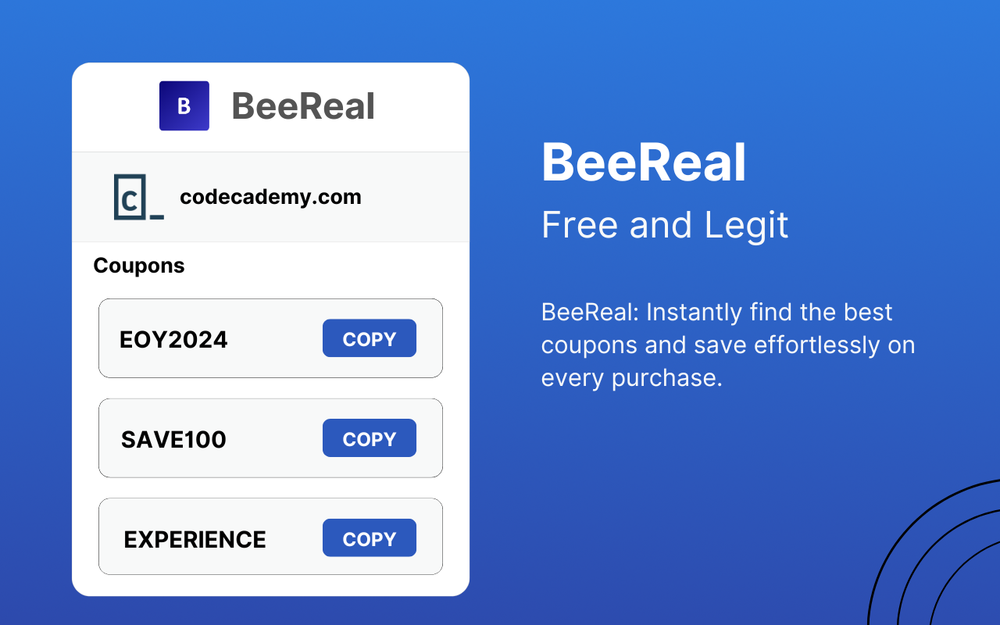

# 🔥 BeeReal: Legit and Open-Sourced 🔥

BeeReal is a free, open-source browser extension designed to enhance your online shopping experience by automatically discovering and applying the best coupon codes across thousands of websites.

## 🌟 Key Features of BeeReal:

- **🛍️ Automated Coupon Application**: Seamlessly discovers and applies the best coupon codes at checkout, saving you money with zero effort.
- **🔒 Privacy-Focused**: Your data stays secure—BeeReal doesn’t sell your information to third parties.
- **💻 Open Source**: A community-driven project where users can review, modify, and enhance its functionality.
- **🧩 User-Friendly Interface**: An intuitive design that integrates effortlessly into your browser for a smooth shopping experience.

By choosing BeeReal, you are joining a community of smart shoppers dedicated to saving time and money without compromising on ethics or privacy. Experience a more efficient and secure way to shop online with BeeReal.
